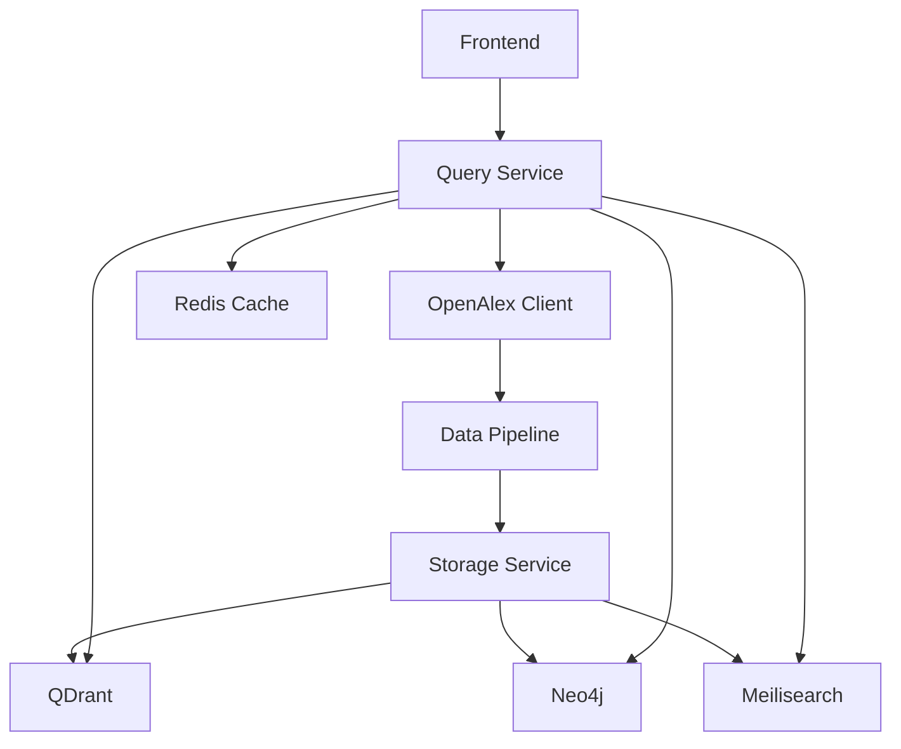

# Project Leibniz - Implementation Planning Document

**Version:** 2.0  
**Date:** June 2025
**Status:** Revised with OpenAlex Integration  
**Classification:** Internal Development

## 1. Executive Summary

This document provides the detailed implementation plan for Project Leibniz's 48-hour development sprint, with OpenAlex Work Objects as the foundational data layer. The revised plan prioritizes early metadata enrichment to enable superior search quality and citation-aware features.

### 1.1 Sprint Overview
- **Duration:** 48 hours
- **Start:** Hour 0 (T+0)
- **End:** Hour 48 (T+48)
- **Primary Goal:** Working demo showing <200ms query responses with rich metadata
- **Secondary Goal:** Complete feature set with citation networks and gap analysis

## 2. Work Breakdown Structure (WBS)

### 2.1 Level 1 Breakdown

```
1. Project Leibniz
   ├── 1.1 Environment Setup (3h)
   ├── 1.2 OpenAlex Integration (6h) [NEW]
   ├── 1.3 Data Pipeline (6h) [REDUCED]
   ├── 1.4 Storage Layer (5h) [REDUCED]
   ├── 1.5 Query Services (8h) [REDUCED]
   ├── 1.6 Intelligence Features (8h)
   ├── 1.7 Frontend Development (8h)
   ├── 1.8 Integration & Testing (3h)
   └── 1.9 Demo Preparation (1h) [REDUCED]
```

### 2.2 Detailed Task Breakdown

#### 1.1 Environment Setup (3 hours)
| ID    | Task                                 | Duration | Dependencies | Deliverable           |
|-------|--------------------------------------|----------|--------------|-----------------------|
| 1.1.1 | Install Docker & Docker Compose      | 0.5h     | None         | Docker running        |
| 1.1.2 | Clone/create repository structure    | 0.5h     | None         | Git repo ready        |
| 1.1.3 | Configure docker-compose.yml         | 1h       | 1.1.1        | All services defined  |
| 1.1.4 | Start all infrastructure services    | 0.5h     | 1.1.3        | Services healthy      |
| 1.1.5 | Verify connectivity between services | 0.5h     | 1.1.4        | Integration confirmed |

#### 1.2 OpenAlex Integration (6 hours) [NEW SECTION]
| ID    | Task                          | Duration | Dependencies | Deliverable                    |
|-------|-------------------------------|----------|--------------|--------------------------------|
| 1.2.1 | Implement OpenAlex API client | 1.5h     | 1.1.5        | API client with rate limiting  |
| 1.2.2 | Create Work Object data model | 1h       | 1.2.1        | Pydantic models defined        |
| 1.2.3 | Build metadata caching layer  | 1h       | 1.1.4        | Redis caching for Work Objects |
| 1.2.4 | Implement batch fetching      | 1h       | 1.2.1        | Efficient bulk operations      |
| 1.2.5 | Create paper ID resolver      | 0.5h     | 1.2.1        | DOI/title → Work ID mapping    |
| 1.2.6 | Test with sample papers       | 1h       | 1.2.5        | Verified metadata retrieval    |

#### 1.3 Data Pipeline (6 hours) [REDUCED FROM 8h]
| ID    | Task                              | Duration | Dependencies | Deliverable               |
|-------|-----------------------------------|----------|--------------|---------------------------|
| 1.3.1 | Fetch conference paper lists      | 2h       | 1.2.4        | Work IDs for 5000 papers  |
| 1.3.2 | Download PDFs with Work ID naming | 2h       | 1.3.1        | W[ID].pdf files           |
| 1.3.3 | Setup GROBID processing pipeline  | 0.5h     | 1.1.4        | GROBID endpoint ready     |
| 1.3.4 | Batch process PDFs through GROBID | 1h       | 1.3.2, 1.3.3 | W[ID].tei.xml files       |
| 1.3.5 | Create unified metadata merger    | 0.5h     | 1.2.2        | Combined metadata objects |

#### 1.4 Storage Layer (5 hours) [REDUCED FROM 6h]
| ID    | Task                                | Duration | Dependencies | Deliverable                |
|-------|-------------------------------------|----------|--------------|----------------------------|
| 1.4.1 | Design Work-based file structure    | 0.5h     | 1.2.2        | Directory layout defined   |
| 1.4.2 | Implement storage service           | 1h       | 1.4.1        | File management API        |
| 1.4.3 | Configure QDrant with metadata      | 1h       | 1.1.4        | Vector store with payloads |
| 1.4.4 | Design citation-aware Neo4j schema  | 0.5h     | 1.1.4        | Graph model with citations |
| 1.4.5 | Build graph import with citations   | 1h       | 1.4.4, 1.3.1 | Citation network loaded    |
| 1.4.6 | Configure Meilisearch with concepts | 1h       | 1.3.1        | Text search with filters   |

#### 1.5 Query Services (8 hours) [REDUCED FROM 10h]
| ID    | Task                               | Duration | Dependencies        | Deliverable               |
|-------|------------------------------------|----------|---------------------|---------------------------|
| 1.5.1 | Implement Query Service API        | 1.5h     | 1.4.3, 1.4.5, 1.4.6 | REST endpoints            |
| 1.5.2 | Add concept-based query expansion  | 1h       | 1.2.1               | Smart query enhancement   |
| 1.5.3 | Implement citation-aware ranking   | 1h       | 1.4.5               | Citation-boosted results  |
| 1.5.4 | Build enhanced embedding generator | 1.5h     | 1.3.5               | Metadata-enriched vectors |
| 1.5.5 | Implement result enrichment        | 1h       | 1.2.1               | Fresh metadata on results |
| 1.5.6 | Add Redis caching layer            | 1h       | 1.5.1               | <200ms responses          |
| 1.5.7 | Implement WebSocket support        | 1h       | 1.5.1               | Real-time updates         |

#### 1.6 Intelligence Features (8 hours)
| ID    | Task                                 | Duration | Dependencies | Deliverable                    |
|-------|--------------------------------------|----------|--------------|--------------------------------|
| 1.6.1 | Citation network analyzer            | 2h       | 1.4.5        | Path finding, common ancestors |
| 1.6.2 | Contradiction detection with context | 2h       | 1.4.5        | Find conflicts with evidence   |
| 1.6.3 | Concept-based gap analysis           | 2h       | 1.4.5        | Identify unexplored areas      |
| 1.6.4 | Synthesis with proper citations      | 1.5h     | 1.5.1        | Auto summaries with refs       |
| 1.6.5 | Pre-computation pipeline             | 0.5h     | 1.6.1, 1.6.2 | Cached insights                |

#### 1.7 Frontend Development (8 hours)
| ID    | Task                           | Duration | Dependencies | Deliverable                |
|-------|--------------------------------|----------|--------------|----------------------------|
| 1.7.1 | Setup React project with Vite  | 0.5h     | None         | Frontend scaffold          |
| 1.7.2 | Implement concept-aware search | 1.5h     | 1.7.1        | Smart query interface      |
| 1.7.3 | Build rich result cards        | 1.5h     | 1.7.1        | Show metadata, citations   |
| 1.7.4 | Create citation network viz    | 2h       | 1.7.1        | Interactive graph          |
| 1.7.5 | Add filters for metadata       | 1h       | 1.7.2        | Filter by venue, year, etc |
| 1.7.6 | Implement progressive loading  | 1h       | 1.7.3        | Instant feedback           |
| 1.7.7 | Polish UI/UX                   | 0.5h     | 1.7.5        | Professional look          |

#### 1.8 Integration & Testing (3 hours)
| ID    | Task                        | Duration | Dependencies | Deliverable        |
|-------|-----------------------------|----------|--------------|--------------------|
| 1.8.1 | End-to-end integration test | 1h       | 1.5.*, 1.7.* | Full flow working  |
| 1.8.2 | Performance benchmarking    | 1h       | 1.8.1        | Metrics documented |
| 1.8.3 | Bug fixes and optimization  | 1h       | 1.8.2        | Stable system      |

#### 1.9 Demo Preparation (1 hour) [REDUCED FROM 2h]
| ID    | Task                   | Duration | Dependencies | Deliverable  |
|-------|------------------------|----------|--------------|--------------|
| 1.9.1 | Prepare demo scenarios | 0.5h     | 1.8.3        | Script ready |
| 1.9.2 | Record demo video      | 0.5h     | 1.9.1        | Video proof  |

## 3. Critical Path Analysis

### 3.1 Critical Path Identification

The revised critical path prioritizing OpenAlex integration:
```
1.1.1 → 1.1.3 → 1.1.4 → 1.2.1 → 1.2.4 → 1.3.1 → 1.4.5 → 1.5.1 → 1.5.6 → 1.8.1 → 1.9.2
Total: 14 hours (reduced from 16.5)
```

### 3.2 Parallel Opportunity Analysis

**Maximum Parallelization Points:**
- T+3h: After infrastructure setup
  - Branch 1: OpenAlex client development (1.2.1-1.2.6)
  - Branch 2: Frontend setup (1.7.1)
  
- T+9h: After OpenAlex integration complete
  - Branch 1: Data pipeline processing
  - Branch 2: Storage layer setup
  - Branch 3: Continue frontend
  - Branch 4: Start intelligence algorithms

### 3.3 Critical Dependencies
1. **OpenAlex Integration** - Blocks all data processing
2. **Work ID Resolution** - Required before any downloads
3. **Citation Data Loading** - Blocks intelligence features
4. **Query Service API** - Blocks frontend integration

## 4. Resource Allocation Schedule

### 4.1 48-Hour Timeline

#### Hours 0-12 (Foundation Phase with OpenAlex)
| Hour    | Primary Task                         | Parallel Task              | Milestone           |
|---------|--------------------------------------|----------------------------|---------------------|
| 0-1     | Environment setup (1.1.1-1.1.2)      | -                          | Dev env ready       |
| 1-2     | Docker compose config (1.1.3)        | -                          | Services defined    |
| 2-3     | Start services, verify (1.1.4-1.1.5) | -                          | Infrastructure live |
| 3-4.5   | OpenAlex API client (1.2.1)          | Frontend setup (1.7.1)     | API client ready    |
| 4.5-5.5 | Work Object models (1.2.2)           | Frontend search UI (1.7.2) | Data models defined |
| 5.5-6.5 | Metadata caching (1.2.3)             | Frontend components        | Redis caching ready |
| 6.5-7.5 | Batch fetching (1.2.4)               | Continue frontend          | Bulk ops ready      |
| 7.5-8   | ID resolver (1.2.5)                  | -                          | Mapping complete    |
| 8-9     | Test OpenAlex integration (1.2.6)    | -                          | Metadata verified   |
| 9-11    | Fetch conference papers (1.3.1)      | Graph schema design        | 5000 Work IDs       |
| 11-12   | Start PDF downloads (1.3.2)          | Build storage service      | Downloads initiated |

**Checkpoint 1 (T+12h):** OpenAlex integrated, downloads started, basic frontend ready

#### Hours 12-24 (Core Features Phase)
| Hour      | Primary Task                 | Parallel Task             | Milestone       |
|-----------|------------------------------|---------------------------|-----------------|
| 12-13     | Continue PDF downloads       | GROBID setup (1.3.3)      | PDFs organizing |
| 13-14     | GROBID processing (1.3.4)    | QDrant config (1.4.3)     | TEI extraction  |
| 14-15     | Build citation graph (1.4.5) | Meilisearch setup         | Graph populated |
| 15-16.5   | Query Service API (1.5.1)    | Citation analyzer (1.6.1) | API skeleton    |
| 16.5-17.5 | Concept expansion (1.5.2)    | Continue citations        | Smart queries   |
| 17.5-18.5 | Citation ranking (1.5.3)     | Contradiction detection   | Ranked results  |
| 18.5-20   | Enhanced embeddings (1.5.4)  | Gap analysis (1.6.3)      | Better vectors  |
| 20-21     | Result enrichment (1.5.5)    | Frontend integration      | Rich results    |
| 21-22     | Redis caching (1.5.6)        | Performance testing       | <200ms achieved |
| 22-23     | WebSocket support (1.5.7)    | Frontend real-time        | Live updates    |
| 23-24     | Integration testing          | Bug fixes                 | System stable   |

**Checkpoint 2 (T+24h):** Core features complete with citations, performance targets met

#### Hours 24-36 (Enhancement Phase)
| Hour  | Primary Task                   | Secondary Task       | Milestone           |
|-------|--------------------------------|----------------------|---------------------|
| 24-26 | Refine citation analysis       | UI polish            | Better insights     |
| 26-28 | Enhance gap analysis           | Citation viz (1.7.4) | Clear opportunities |
| 28-30 | Optimize caching strategies    | Metadata filters     | Consistent speed    |
| 30-32 | Synthesis improvements (1.6.4) | Documentation        | Better summaries    |
| 32-34 | Frontend responsiveness        | Mobile testing       | Cross-platform      |
| 34-36 | Full system integration test   | Fix critical bugs    | Stable demo         |

**Checkpoint 3 (T+36h):** Enhanced features with citations, polished UI

#### Hours 36-48 (Polish & Demo Phase)
| Hour  | Primary Task             | Secondary Task        | Milestone        |
|-------|--------------------------|-----------------------|------------------|
| 36-38 | Pre-computation (1.6.5)  | Cache common queries  | Instant results  |
| 38-40 | Performance benchmarking | Prepare metrics       | Proven speed     |
| 40-42 | Create demo scenarios    | Practice presentation | Demo ready       |
| 42-43 | Record demo video        | Multiple takes        | Video complete   |
| 43-44 | Write documentation      | Create README         | Docs complete    |
| 44-46 | Final testing            | Deploy to cloud       | Live system      |
| 46-48 | Buffer time              | Handle surprises      | Project complete |

**Final Checkpoint (T+48h):** Demo video recorded, system deployed with full citations

## 5. Risk Management Plan

### 5.1 Risk Register

| ID | Risk                           | Probability | Impact   | Mitigation Strategy                     | Contingency Plan           |
|----|--------------------------------|-------------|----------|-----------------------------------------|----------------------------|
| R1 | OpenAlex API downtime          | Low         | Critical | Aggressive caching, batch pre-fetch     | Use cached data only       |
| R2 | Missing OpenAlex records       | Medium      | High     | Multiple ID resolution methods          | Create minimal records     |
| R3 | Rate limit exceeded            | Medium      | High     | Implement backoff, use free tier wisely | Pause and retry            |
| R4 | Complex data model integration | High        | High     | Start integration early (T+3h)          | Simplify relationships     |
| R5 | GROBID parsing failures        | Medium      | Medium   | Handle gracefully, use abstract         | OpenAlex abstract fallback |
| R6 | Citation graph too large       | Medium      | Medium   | Limit depth, paginate                   | Show top citations only    |
| R7 | Performance targets missed     | Medium      | High     | Cache aggressively from start           | Reduce feature scope       |
| R8 | Time underestimation           | High        | High     | Front-load critical work                | Cut P2 features            |

### 5.2 Risk Response Timeline

**Proactive Mitigations (T+0 to T+6):**
- Test OpenAlex API with sample queries
- Verify rate limits and implement backoff
- Pre-fetch metadata for known conferences
- Design efficient caching strategy

**Continuous Monitoring:**
- Track API call count every hour
- Monitor cache hit rates
- Check metadata completeness
- Measure query performance

**Decision Points:**
- T+9h: Confirm OpenAlex integration success
- T+12h: Go/no-go on full citation features
- T+24h: Feature freeze decision
- T+36h: Demo scenario selection

## 6. Quality Gates

### 6.1 Quality Checkpoints

#### Checkpoint 1 (T+12h) - Foundation with Metadata
**Pass Criteria:**
- [ ] All services running in Docker
- [ ] OpenAlex client tested and working
- [ ] 5000 Work IDs fetched with metadata
- [ ] PDF downloads started with W[ID] naming
- [ ] Basic frontend renders

**Fail Actions:**
- Use pre-cached conference metadata
- Reduce paper count to 1000
- Skip PDF download, use metadata only

#### Checkpoint 2 (T+24h) - Core Features with Citations
**Pass Criteria:**
- [ ] Query response <200ms (95th percentile)
- [ ] Citation network searchable
- [ ] Concept expansion working
- [ ] Result enrichment functional
- [ ] WebSocket updates working

**Fail Actions:**
- Disable citation path finding
- Use simple ranking without citations
- Cache all common queries

#### Checkpoint 3 (T+36h) - Demo Ready with Intelligence
**Pass Criteria:**
- [ ] End-to-end flow working
- [ ] Citation visualization functional
- [ ] Gap analysis showing results
- [ ] Synthesis includes proper citations
- [ ] UI shows rich metadata

**Fail Actions:**
- Simplify citation viz to counts only
- Pre-compute gap analysis results
- Use template-based synthesis

### 6.2 Quality Metrics

| Metric                      | Target | Minimum Acceptable |
|-----------------------------|--------|--------------------|
| Query response time (p95)   | <200ms | <500ms             |
| Metadata completeness       | >95%   | >80%               |
| Citation accuracy           | 100%   | 95%                |
| Cache hit rate              | >80%   | >60%               |
| Concept expansion relevance | >90%   | >70%               |

## 7. Task Prioritization Matrix

### 7.1 MoSCoW Analysis

#### Must Have (P0)
- OpenAlex integration and Work Objects
- Vector search with metadata enrichment
- Citation network in Neo4j
- Basic query interface with metadata display
- <200ms response time

#### Should Have (P1)
- Concept-based query expansion
- Citation-aware ranking
- Contradiction detection with context
- WebSocket real-time updates
- Rich result cards with venue/author info

#### Could Have (P2)
- Complex citation path finding
- Full gap analysis with scoring
- Synthesis with inline citations
- Timeline visualization
- Author collaboration networks

#### Won't Have (P3)
- User authentication
- Personal libraries
- PDF annotation
- Mobile app

### 7.2 Feature Degradation Plan

If running behind schedule, degrade in this order:
1. Simplify citation viz to counts (save 1h)
2. Remove synthesis generation (save 1.5h)
3. Skip gap analysis (save 2h)
4. Basic metadata display only (save 2h)
5. Pre-cached demo data (save 6h)

## 8. Development Workflow

### 8.1 Git Strategy

```bash
# Repository structure with OpenAlex
project-leibniz/
├── .github/workflows/     # CI/CD
├── docker/               # Dockerfiles
├── services/            
│   ├── gateway/         # API Gateway
│   ├── query/           # Query Service
│   ├── openalex/        # OpenAlex Client [NEW]
│   ├── synthesis/       # Synthesis Service
│   └── pipeline/        # Data Pipeline [NEW]
├── frontend/            # React app
├── data/
│   ├── works/          # W[ID] directories [NEW]
│   ├── cache/          # API response cache [NEW]
│   └── indices/        # Pre-built indices [NEW]
├── tests/              # Test suites
└── docker-compose.yml

# Branching strategy
main
├── feature/openalex-integration [NEW]
├── feature/citation-network [NEW]
├── feature/query-service
├── feature/frontend
└── feature/intelligence
```

### 8.2 Data Model Conventions

```python
# Standard Work ID usage throughout codebase
work_id = "W302740479"  # Not full URL
work_dir = Path(f"data/works/{work_id}")
work_files = {
    "metadata": work_dir / "work.json",
    "pdf": work_dir / "paper.pdf",
    "tei": work_dir / "grobid.tei.xml",
    "embeddings": work_dir / "embeddings.npy"
}
```

## 9. Integration Points

### 9.1 Service Dependencies



### 9.2 Data Flow Checkpoints

1. **OpenAlex → Storage**: Verify Work Objects saved correctly
2. **Storage → Databases**: Check all indices updated
3. **Query → Results**: Ensure metadata enrichment works
4. **Cache → Response**: Validate <200ms timing

## 10. Demo Scenarios

### 10.1 Showcase Scenarios

#### Scenario 1: "Rich Metadata Search"
- Query: "transformer efficiency"
- Show: Instant results with venue badges, citation counts
- Highlight: "Notice the ICLR 2023 badge and 245 citations"

#### Scenario 2: "Citation Network Discovery"
- Click: Any paper result
- Show: Citation graph expanding
- Highlight: "See how this paper builds on BERT and influenced 15 later works"

#### Scenario 3: "Concept-Based Gap Finding"
- Query: "unexplored vision transformer combinations"
- Show: Gap analysis with OpenAlex concepts
- Highlight: "ViT + Neural Architecture Search is unexplored but feasible"

#### Scenario 4: "Smart Contradiction Detection"
- Query: "contradictions in bert performance"
- Show: Papers with conflicting claims and publication context
- Highlight: "Different evaluation protocols explain the 3% discrepancy"

### 10.2 Performance Demos

```python
# Demo performance script
DEMO_QUERIES = [
    {
        "query": "sparse attention mechanisms",
        "expected_time_ms": 150,
        "highlight_features": ["citation_count", "venue", "concepts"]
    },
    {
        "query": "papers citing 'Attention Is All You Need'",
        "expected_time_ms": 180,
        "highlight_features": ["citation_network", "influence_score"]
    }
]
```

## 11. Success Metrics

### 11.1 Technical Metrics

| Metric                    | Target | Stretch Goal |
|---------------------------|--------|--------------|
| Query latency (p50)       | 100ms  | 50ms         |
| Query latency (p95)       | 200ms  | 150ms        |
| Papers with full metadata | 5,000  | 10,000       |
| Citation relationships    | 50,000 | 100,000      |
| Concept coverage          | 95%    | 99%          |
| Cache hit rate            | 80%    | 90%          |

### 11.2 Demo Impact Metrics

| Demonstration           | Traditional Time | Our System | Improvement |
|-------------------------|------------------|------------|-------------|
| Find relevant papers    | 30 min           | 0.2 sec    | 9000x       |
| Trace citation paths    | 2 hours          | 5 sec      | 1440x       |
| Identify contradictions | 3 hours          | 2 sec      | 5400x       |
| Find research gaps      | Days             | 30 sec     | 2880x+      |
| Generate bibliography   | 1 hour           | 10 sec     | 360x        |

## 12. Post-Sprint Actions

### 12.1 Immediate (T+48 to T+72)
- [ ] Deploy demo with full citation network
- [ ] Create video showing metadata richness
- [ ] Document OpenAlex integration patterns
- [ ] Share citation graph visualizations
- [ ] Open source with clear setup guide

### 12.2 Future Enhancements
- Expand to all OpenAlex CS papers
- Add author collaboration networks
- Implement citation context extraction
- Build institution-level analytics
- Create research trend predictions

## 13. Version History

| Version | Date     | Author       | Changes                             |
|---------|----------|--------------|-------------------------------------|
| 1.0     | Jun 2025 | Project Team | Initial implementation plan         |
| 2.0     | Jun 2025 | Project Team | Revised with OpenAlex as foundation |

---

**Document Status:** Ready for Execution  
**Next Step:** Environment Setup with OpenAlex Integration